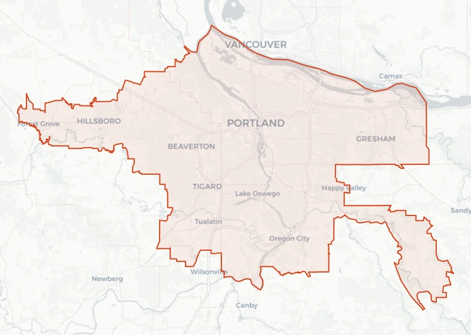

# TriMet District Boundary

TriMet district boundary. **1 Polygon features** covering the TriMet
service district in the Portland, Oregon metropolitan area, published by TriMet
as `tm_boundary` and last updated at the source on
**January 09, 2013**.

A single polygon: the legal service district TriMet is chartered to serve. It
carries TriMet's own area figures — 533 square miles, 341,554 acres — as
attributes, so you do not need to compute area from the geometry.

The district covers most of the urbanized parts of Multnomah, Washington and
Clackamas counties. Its edge is not a county boundary and not the Metro urban
growth boundary; it is the taxing and service district, and it excludes parts of
all three counties.

> **Agents:** see [AGENTS.md](./AGENTS.md) for join keys, verified query recipes
> and the caveats that will otherwise cost you a wrong answer.



## Quick start

Read it straight from object storage — DuckDB fetches only the byte ranges it
needs, so there is nothing to download first:

```sql
INSTALL spatial; LOAD spatial;
INSTALL httpfs;  LOAD httpfs;

SELECT * FROM 'https://data.source.coop/cholmes/trimet/district-boundary/district-boundary.parquet' LIMIT 10;
```

Or with GeoPandas:

```python
import geopandas as gpd
gdf = gpd.read_parquet("https://data.source.coop/cholmes/trimet/district-boundary/district-boundary.parquet")
```

## Suggested uses

- Clipping other datasets to TriMet's actual service area rather than to county lines.
- As the denominator in transit-access analyses: what share of district population,
  jobs or parcels lies within a given walk of a stop.
- As a base layer for maps of the other seven collections — every thumbnail in
  this catalog draws it underneath for exactly that reason.

## Limitations and inappropriate uses

- **This is a service district, not a jurisdiction.** It does not align with city
  limits, county boundaries, or Metro's urban growth boundary. Do not use it as a
  proxy for "Portland" or for any administrative geography.
- **It is the oldest layer here by more than a decade.** TriMet's metadata page
  gives its last update as January 09, 2013. The district has been essentially
  stable, but treat the edge as approximate for anything legal or financial.
- **Being inside the boundary does not mean being served.** Large parts of the
  district have no stop within walking distance. Join to `stops` to answer
  service questions.

## Schema

| Column | Type | Description |
|---|---|---|
| `area_sq_mi` | int64 | Area in square miles |
| `acres` | int64 | Area in acres. |
| `geometry` | binary | Feature geometry, WGS84 lon/lat. |
| `geometry_bbox` | struct<xmin: float not null, ymin: float not null, xmax: float not null, ymax: float not null> |  |

Column descriptions are TriMet's own, taken verbatim from
[meta_tm_boundary.shtml](https://developer.trimet.org/gis/meta_tm_boundary.shtml). The same text is carried in
`table:columns` in [collection.json](./collection.json).

## Visualization

| Style | What it shows |
|---|---|
| [`default.json`](./styles/default.json) | The TriMet service district as a tinted fill with a TriMet-orange edge. The fill uses TriMet's own basemap water tint at low opacity so the district reads as an area without hiding a basemap underneath. |
| [`context.json`](./styles/context.json) | A solid, opaque fill in TriMet's basemap building gray. Use this as a backdrop underneath the stop and route layers when no basemap is available, so the network has a visible service area behind it. |
| [`outline.json`](./styles/outline.json) | The district edge with no fill, for overlaying on top of other layers without tinting what is underneath. |

The PMTiles layer is named `district-boundary`. Styles reference it as `../district-boundary.pmtiles`,
so they load unmodified against this directory.

## Files

| File | Size | What it is |
|---|---|---|
| [`district-boundary.parquet`](./district-boundary.parquet) | 90.8 KB | GeoParquet 1.1, 1 rows in 1 row group(s), zstd, Hilbert-ordered, bbox covering column |
| [`district-boundary.pmtiles`](./district-boundary.pmtiles) | 26.9 KB | Vector tiles for display, every feature kept at every zoom |
| [`thumbnail.webp`](./thumbnail.webp) | 48.6 KB | Rendered from `styles/default.json` over a light basemap |
| [`collection.json`](./collection.json) | — | STAC Collection metadata |

## Provenance

[](https://developer.trimet.org/gis/)

Produced by **TriMet GIS** (4012 SE 17th Ave, GIS3,
Portland, OR 97202, gis@trimet.org) and distributed at
[developer.trimet.org/gis](https://developer.trimet.org/gis/) as `tm_boundary`.

The originals are linked as assets and are the authoritative copy:
[Shapefile](https://developer.trimet.org/gis/data/tm_boundary.zip) · [KML](https://developer.trimet.org/gis/data/tm_boundary.kml) · [Metadata](https://developer.trimet.org/gis/meta_tm_boundary.shtml)

This collection was produced by reprojecting TriMet's Shapefile from
EPSG:2913 (NAD83(HARN) / Oregon North (ft)) to EPSG:4326 and writing GeoParquet and
PMTiles. No features were added, removed or edited. The exact commands are in
[`tools/convert.py`](https://github.com/cholmes/portolan-catalog-trimet/blob/main/tools/convert.py).

## License, and a warning

TriMet distributes these datasets free of charge, but **the terms of use do not
grant redistribution rights**. Section 4 of TriMet's
[Terms of Use](https://developer.trimet.org/terms_of_use.shtml) reserves
reproduction, modification, distribution and republication of site Content
without written consent; the redistribution license in section 5 covers the Web
Services API, not these GIS downloads. The collections therefore declare
`"license": "other"` with a link to those terms, rather than claiming an open
license the source does not offer.

Practically: use the data, and contact **gis@trimet.org** before redistributing
it or building a product on it. If you need transit data under clear open terms,
TriMet's [GTFS feed](https://developer.trimet.org/GTFS.shtml) is the better
starting point.

